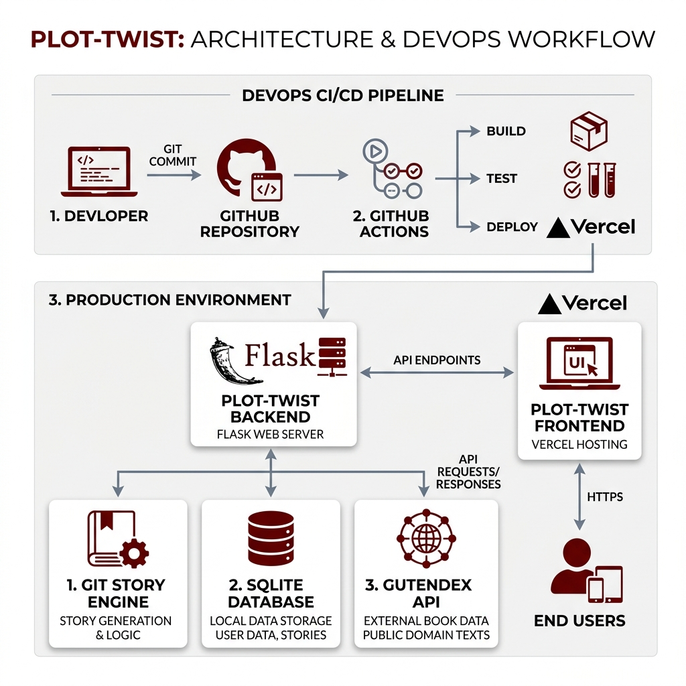

# PLOT-TWIST: Git-Integrated Narrative Engine

## 1. Project Title
**PLOT-TWIST** — An interactive storytelling platform where narrative paths are physically represented by Git branches.

---

## 2. Problem Statement
Our team recognized that traditional interactive fiction often lacks a tangible connection between user choices and the underlying system state. We aimed to build a "meta" narrative experience where each decision triggers a version control operation, effectively making the story a part of the repository's development history. Furthermore, we needed to solve the challenge of maintaining a stable, high-performance deployment in a collaborative environment, which we addressed by implementing a robust DevOps pipeline.

---

## 3. Architecture Diagram

*Our system architecture showing the flow from GitHub Actions to Vercel, integrating Flask, Git, and the Gutendex API.*

---

## 4. CI/CD Pipeline Explanation
We implemented a multi-stage automated pipeline using **GitHub Actions** to ensure code quality and seamless deployment:
1.  **Build Stage**: Our pipeline initializes a Python 3.10 environment, installs necessary dependencies from `requirements.txt`, and performs linting to catch syntax errors early.
2.  **Test Stage**: We execute a "Smoke Test" that validates the Flask application's ability to initialize its core components and database schema without errors.
3.  **Deploy Stage**: Upon a successful merge into the `main` branch, the pipeline automatically triggers a production deployment to **Vercel**, ensuring our live application is always synchronized with the codebase.

---

## 5. Git Workflow Used
Our team utilized a **Feature Branching Workflow** to maintain repository health:
*   **Main Branch**: Reserved strictly for production-ready, stable code.
*   **Feature Branches**: We developed new logic (like the DevOps enhancement) in isolated branches (e.g., `feature/devops-enhancement`) before merging via Pull Requests (PRs).
*   **Commits**: We maintained a history of meaningful, atomic commits to ensure clear traceability of our development progress.

---

## 6. Tools Used
*   **Backend**: Flask (Python), SQLAlchemy (SQLite).
*   **DevOps**: GitHub Actions (CI/CD), Git (Version Control).
*   **Deployment**: Vercel (Production Hosting).
*   **APIs**: Gutendex API (Narrative Content Ingestion).
*   **Design**: CSS Variables (Burgundy & Cream Narrative Theme).

---

## 7. Screenshots
### Pipeline Success

### Deployment Output

---

## 8. Challenges Faced
*   **API Latency**: We encountered significant latency while fetching large book texts from the Gutendex API. We solved this by implementing a **Global Caching Layer** that stores story content for one hour.
*   **Serverless Pathing**: Moving from local development to a serverless environment (Vercel) caused pathing errors for our `stories.json` archives. We addressed this by implementing **Absolute Pathing** logic using `app.root_path`.
*   **Git Sanitization**: User identities could occasionally contain characters that crashed the Git branch naming logic. We implemented a **Sanitization Filter** to ensure all branch operations remain safe and reliable.
